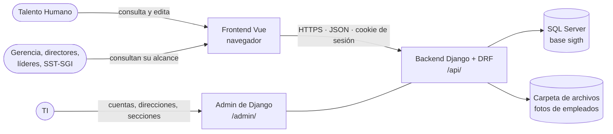
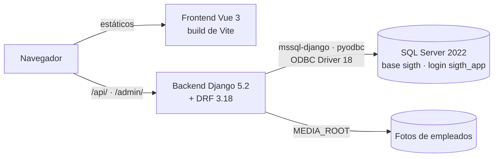
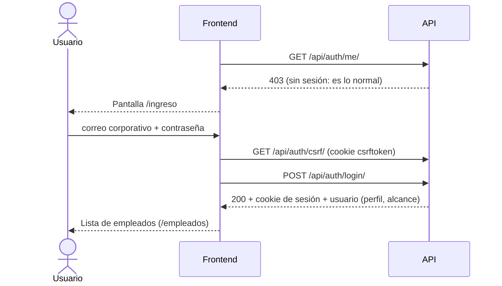
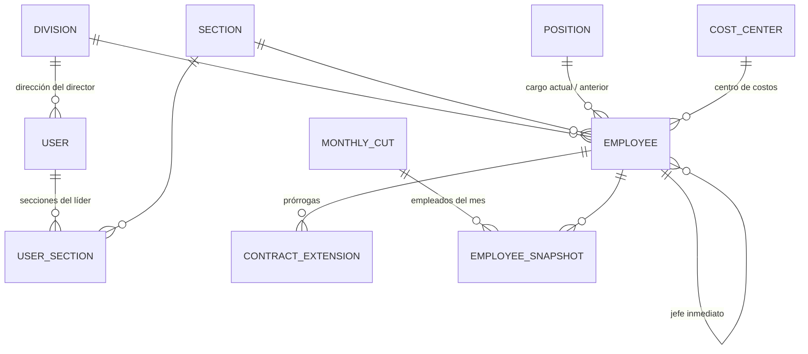

# SIGTH — Documentación técnica y de traspaso

| | |
|---|---|
| **Código** | FB-INM-P03 |
| **Sistema** | SIGTH — Sistema de Información y Gestión de Talento Humano |
| **Repositorio** | `github.com/JuanTrujilloM/forjas-SIGTH` (cuenta personal de GitHub) |
| **Área beneficiaria** | Talento Humano |
| **Solicitado por** | Claudia Lopera, Talento Humano |
| **Autor** | Juan Trujillo, practicante de inmersión |
| **Receptor en TI** | Ferney Lopez |
| **Fecha de inicio** | 2026-04-06 (el repositorio empieza el 2026-08-25) |
| **Fecha de entrega** | 2026-10-15 (prevista) |
| **Estado del sistema** | En desarrollo: corre en entorno local; sin servidor de producción definido |
| **Versión del documento** | 0.3 (borrador) |

Documento funcional para usuarios: `FB-INM-P03-TH-Informe-de-entrega`.

Este documento es la **puerta de entrada** para TI. Junto con las decisiones de
[`adr/`](adr/) y las guías de [`guias/`](guias/), cubre el diseño, las reglas y la
operación del sistema.

## Contenido

1. [Introducción y objetivos](#1-introducción-y-objetivos)
2. [Contexto y alcance](#2-contexto-y-alcance)
3. [Restricciones y supuestos](#3-restricciones-y-supuestos)
4. [Arquitectura y componentes](#4-arquitectura-y-componentes)
5. [Flujos principales](#5-flujos-principales)
6. [Modelo de datos y API](#6-modelo-de-datos-y-api)
7. [Seguridad, accesos y datos personales](#7-seguridad-accesos-y-datos-personales)
8. [Entorno de desarrollo](#8-entorno-de-desarrollo)
9. [Despliegue y configuración](#9-despliegue-y-configuración)
10. [Operación (runbook)](#10-operación-runbook)
11. [Decisiones técnicas](#11-decisiones-técnicas)
12. [Riesgos y deuda técnica](#12-riesgos-y-deuda-técnica)
13. [Inventario de entrega](#13-inventario-de-entrega)
14. [Glosario](#14-glosario)

---

## 1. Introducción y objetivos

### 1.1 Propósito

Toda la información del personal de Forjas Bolívar vive hoy en **un archivo de Excel que
maneja Talento Humano**. Cuando alguien de otra dirección necesita un dato, le escribe a
esa persona y espera la respuesta.

SIGTH reemplaza ese flujo con una plataforma web interna:
- cada persona autorizada entra con su correo corporativo;
- cada una **ve directamente los empleados y los datos que le corresponden según su perfil**;
- **solo Talento Humano crea y edita** información.

El objetivo es quitar el intermediario **sin abrir la información de más**.

### 1.2 Funcionalidades de esta fase

- Ingreso con correo corporativo y contraseña (sesión por cookie).
- **Listado de empleados** con búsqueda, filtros (incluidos rangos de fecha de ingreso y
  de vencimiento del contrato), orden y miniatura de la foto. Los filtros quedan en la
  dirección de la página, así que se conservan al volver de una ficha. Es la pantalla de
  inicio. Un selector de mes muestra a los empleados tal como quedaron en cada **corte
  mensual**.
- **Estructura organizacional**: organigrama por jefe inmediato y vista agrupada por
  dirección y sección, sobre el alcance de cada perfil.
- **Ficha del empleado**, organizada por bloques de datos.
- **Creación y edición** de empleados, solo para Talento Humano, incluidas la foto y las
  prórrogas de contrato.
- **Recorte de filas y columnas por perfil**, en el backend (§7).
- **Historial de cambios**: quién cambió qué y cuándo.
- **Admin de Django** para que TI gestione cuentas, direcciones y secciones, y para que
  Talento Humano gestione los catálogos de cargos y de centros de costos.

- **Reportes y consultas** (`/reportes`): filtros combinados, elección y orden de campos,
  vista previa y descarga en Excel, CSV o PDF, con reportes listos (ingresos y retiros
  del mes, por dirección, por líder y por sección). Cada descarga queda registrada.

**Aún no construido**: los indicadores con gráficas. La carga inicial de los datos reales
la hace TI.

### 1.3 Objetivos de calidad

| Prioridad | Objetivo | Cómo se garantiza |
|---|---|---|
| 1 | **Confidencialidad**: nadie ve empleados ni datos fuera de su perfil | Una sola política decide filas y columnas en el backend; fuera de alcance responde 404 (§7.1) |
| 2 | **Trazabilidad**: saber quién cambió cada dato | `django-simple-history` sobre empleados y cuentas |
| 3 | **Seguridad por defecto** | Todo lo sensible cuelga de `DEBUG`, que por defecto es `False`. Ningún secreto en el repositorio |
| 4 | **Mantenibilidad** | Convenciones de código comunes (§4.3), un archivo por modelo, vista o serializer |

---

## 2. Contexto y alcance



*Figura 1. Diagrama de contexto*

| Actor | Relación con el sistema |
|---|---|
| Talento Humano (Jefe de TH) | Ve a todos los empleados y es el único que crea y edita |
| Gerencia General | Ve a todos, en solo lectura |
| SST - SGI | Ve a todos, sin datos de contacto, salario, pensión ni observaciones |
| Directores (5 direcciones) | Ven los empleados de su dirección |
| Líderes, coordinadores, jefes de área | Ven los empleados de las secciones a su cargo |
| TI | Administra cuentas desde el admin. Por la API no ve empleados |

**Fuera de alcance de esta fase**:
- otros procesos de talento humano (nómina, capacitaciones, dotación, ausentismo, evaluaciones);
- auto-registro y recuperación pública de contraseña;
- inicio de sesión único (SSO);
- acceso desde internet: el sistema es interno.

---

## 3. Restricciones y supuestos

| Tipo | Restricción / supuesto |
|---|---|
| Base de datos | **SQL Server**, porque es el motor que ya tiene la empresa. Nunca SQLite ni PostgreSQL, ni siquiera en desarrollo |
| Infraestructura | **TI monta el sistema en su propio servidor** y decide sistema operativo, servidor web, proceso de despliegue y quién corre las migraciones. El repositorio no trae configuración de despliegue |
| Red | Sistema interno, no expuesto a internet |
| Cuentas | Las crea TI. El identificador es el correo del dominio corporativo (`CORPORATE_EMAIL_DOMAIN`) |
| Fuente de los datos | Especificación "Base de Datos Personal" de Talento Humano y organigrama DR-DI-03. **No entran al repositorio**, igual que el Excel real |
| Pruebas | No hay suite de pruebas automatizadas en esta etapa (§12) |

---

## 4. Arquitectura y componentes

### 4.1 Estrategia de solución

Es un monorepo con dos aplicaciones independientes que solo se comunican por HTTP:
- una **API REST** en Django + DRF, que concentra toda la lógica y el control de acceso;
- una **SPA** en Vue 3, que solo consume esa API.

En producción, backend y frontend se sirven **bajo el mismo dominio**, así que la cookie
de sesión basta y no hay tokens.

### 4.2 Contenedores



*Figura 2. Diagrama de contenedores*

| Componente | Tecnología y versión | Responsabilidad | Ubicación |
|---|---|---|---|
| Backend | Python 3.13 · Django 5.2.16 · DRF 3.18.0 | API, control de acceso, admin, historial | `backend/` |
| Base de datos | SQL Server 2022 (desarrollo: contenedor Docker, collation `Modern_Spanish_CI_AS`) | Datos de empleados, cuentas e historial | Externa |
| Driver | ODBC Driver 18 for SQL Server · `mssql-django` 1.7.4 · `pyodbc` 5.3.0 | Conexión a SQL Server | — |
| Frontend | Vue 3.5 · TypeScript 6 · Vite 8 · Pinia · Vue Router · Axios · Bootstrap 5.3 | Pantallas de negocio | `frontend/` |
| Archivos | Carpeta local (`MEDIA_ROOT`) | Fotos de empleados, servidas solo por la API | Provisional: la ubicación en producción la define TI |

Dependencias completas: [`backend/requirements.txt`](../backend/requirements.txt) y
[`frontend/package.json`](../frontend/package.json). Cada una responde a una necesidad
concreta del proyecto: no se agregan dependencias sin justificarlo.

### 4.3 Estructura del código

```
forjas-SIGTH/
├── backend/
│   ├── config/        settings, urls raíz, wsgi/asgi
│   ├── users/         cuentas, direcciones, secciones, perfiles y políticas de acceso (access/)
│   └── employees/     empleados, cargos, centros de costos, prórrogas, fotos
├── frontend/src/
│   ├── app/           App.vue, main.ts, router.ts
│   ├── views/         LoginView, EmployeeListView, EmployeeDetailView, EmployeeFormView
│   ├── components/    cabecera, ficha, foto, selector de empleado
│   ├── services/      un servicio por dominio; solo BaseService importa axios
│   ├── stores/        sesión (Pinia)
│   └── types/         tipos por dominio
└── docs/              este documento, decisiones (adr/) y guías (guias/)
```

Convenciones de código:

- **Backend.** Cada app separa su código en paquetes (`models/`, `serializers/`, `views/`,
  `services/`, `enums/`, `filters/`, `validators/`, `management/`), con un archivo por
  clase, reexportado desde su `__init__.py`. La lógica de negocio va en `services/`, no
  en las vistas. Lint con `flake8` (línea máxima de 100).
- **Frontend.** Vue con `<script setup lang="ts">`, un servicio por dominio sobre
  `BaseService` (el único que importa axios), tipos en `types/` y estilos con Bootstrap.
  Formato con Prettier y lint con ESLint.
- **Idioma.** El código y sus comentarios van en inglés; la documentación y todo texto
  que ve el usuario, en español. Los comentarios son de una sola línea y solo explican lo
  que el código no dice.

---

## 5. Flujos principales

### 5.1 Ingreso



*Figura 3. Flujo de ingreso*

El detalle, incluidas las trampas de CSRF en desarrollo, está en
[`docs/guias/autenticacion.md`](guias/autenticacion.md).

### 5.2 Consulta de empleados con recorte de acceso

1. El frontend pide `GET /api/employees/?page=…&search=…`.
2. `EmployeeScopedMixin.get_queryset()` le pide a **`EmployeeScopePolicy`** las filas del
   perfil: todos, su dirección o sus secciones.
3. El serializer, con **`EmployeeFieldsMixin`**, le pide a **`EmployeeFieldPolicy`** las
   columnas visibles y descarta el resto. La clave no viene en la respuesta.
4. Los filtros, la búsqueda y el orden solo aceptan columnas visibles. Para no dibujar un
   filtro que el backend va a ignorar, `GET /api/auth/me/` trae `readable_fields`: la
   lista de columnas que el perfil ve. Es solo para la interfaz; quien decide sigue
   siendo el backend.
5. Un empleado fuera de alcance, pedido por `id`, responde **404**.

### 5.3 Edición por Talento Humano

1. `EmployeeWritePermission` solo deja pasar `POST`/`PUT`/`PATCH` al perfil Talento Humano.
2. Cada cambio queda en el historial con el usuario que lo hizo (`HistoryRequestMiddleware`).
3. No existe `DELETE` de empleados: se retiran cambiando `status` a Retirado, con su
   fecha de retiro.

---

## 6. Modelo de datos y API

### 6.1 Entidades



*Figura 4. Modelo de datos*

| Entidad | App | Descripción | Historial |
|---|---|---|---|
| `Division` | users | Dirección (5 cargadas por migración) | — |
| `Section` | users | Sección o proceso (35 cargadas por migración) | — |
| `User` | users | Cuenta. Se autentica por `email`. Tiene `profile`, `division` y `sections` | Sí (sin contraseña ni último ingreso) |
| `UserSection` | users | Secciones a cargo de un Líder | Sí |
| `Position` | employees | Cargo. Catálogo editable por TH desde el admin (31 cargados) | — |
| `CostCenter` | employees | Centro de costos: código y nombre. Catálogo editable por TH desde el admin (21 códigos cargados; el nombre arranca igual al código) | — |
| `Employee` | employees | Un modelo plano, espejo de la especificación de TH | Sí |
| `MonthlyCut` | employees | Corte mensual: la fecha de cierre de un mes | — |
| `EmployeeSnapshot` | employees | Copia de un empleado en un corte: todas sus columnas a esa fecha, más su dirección, sección y estado de ese mes | — |
| `ContractExtension` | employees | Prórroga de contrato (varias por empleado). Guarda desde cuándo rige; registrarla mueve la fecha de vencimiento del empleado | Sí |

Reglas del modelo de empleado:

- Un empleado **no se borra**: se retira cambiando su estado (Activo / Retirado) y
  registrando la **fecha de retiro**, obligatoria para un retirado y no anterior a la de
  ingreso. Si vuelve a quedar Activo, la fecha de retiro se borra; el historial conserva
  la anterior.
- La identificación es **única sin importar el tipo de documento**: quien pasa de T.I. a
  cédula con el mismo número conserva su registro.
- Del cargo anterior se guarda solo el último, con sus fechas.
- **Una prórroga mueve la fecha de vencimiento.** Se registra desde la ficha: el sistema
  sugiere la nueva fecha (contrato fijo menor a un año: el mismo plazo hasta 3 prórrogas,
  luego un año; fijo de un año: un año) y Talento Humano la confirma o la cambia. En el
  admin las prórrogas son de solo lectura, para que no haya una prórroga sin vencimiento
  nuevo.
- Son **obligatorios** los datos que tiene todo empleado. Quedan opcionales solo los que
  no aplican a todos: foto, correo, título, dirección (Gerencia y Junta Directiva no
  tienen), jefe inmediato, cargo anterior, auxilio de transporte, fecha de vencimiento,
  prórroga indefinido, fondos de pensión y de cesantías, observaciones y formación.
- Ciudad, municipio de nacimiento, nacionalidad y formación son texto libre.
- Edad, antigüedad y valor hora (salario / 210, por la jornada de 42 horas semanales) se
  **calculan y no se guardan**, para que no se desactualicen.

Los campos están en `backend/employees/models/Employee.py` y las listas de valores de
cada uno en `backend/employees/enums/`.

### 6.2 API

Todo cuelga de `/api/`, sin prefijo de versión. Permiso por defecto: `IsAuthenticated`.

| Método | Ruta | Descripción | Quién |
|---|---|---|---|
| GET | `/api/auth/csrf/` | Entrega la cookie CSRF | Cualquiera |
| POST | `/api/auth/login/` | Abre la sesión | Cualquiera |
| POST | `/api/auth/logout/` | Cierra la sesión | Autenticado |
| GET | `/api/auth/me/` | Usuario actual, perfil, alcance y columnas visibles (`readable_fields`) | Autenticado |
| GET | `/api/employees/` | Listado paginado (25), con búsqueda por nombre o identificación, filtros (`hire_date_from/to`, `contract_end_date_from/to`, `retirement_date_from/to` y los de lista de valores) y orden | Autenticado, recortado por perfil |
| GET | `/api/employees/{id}/` | Detalle | Autenticado, recortado (404 fuera de alcance) |
| POST / PUT / PATCH | `/api/employees/` · `/api/employees/{id}/` | Crear / editar | Solo Talento Humano |
| GET | `/api/monthly-cuts/` | Cortes mensuales disponibles | Autenticado |
| GET | `/api/monthly-cuts/{id}/employees/` | Empleados de un corte, con búsqueda y filtros de estado, dirección y sección | Autenticado, recortado por perfil con la dirección y la sección de ese mes |
| POST | `/api/monthly-cuts/{id}/retake/` | Rehacer el último corte con los datos de hoy | Solo Talento Humano |
| GET | `/api/employees/export-fields/` | Campos que el perfil puede elegir para un reporte | Autenticado |
| GET | `/api/employees/report/?fields=…` | Vista previa paginada de un reporte, con los mismos filtros que el listado (más `team_of`: el equipo de un jefe, con toda su cadena) | Autenticado, recortado por perfil |
| GET | `/api/employees/export/?file_format=xlsx\|csv\|pdf&fields=…` | Descarga del reporte; queda en el registro de descargas | Autenticado, recortado por perfil |
| GET | `/api/employees/org-chart/` | Empleados activos del alcance con su jefe inmediato, cargo, dirección y sección, para el organigrama | Autenticado, recortado por perfil |
| GET | `/api/employees/contract-alerts/` | Activos cuyo contrato vence en 50 días o menos, y los ya vencidos, con los días que faltan | Solo Talento Humano |
| GET | `/api/employees/choices/` | Listas de valores de los campos visibles | Autenticado |
| GET | `/api/employees/{id}/extensions/` | Nueva fecha de vencimiento sugerida por la regla legal | Solo Talento Humano |
| POST | `/api/employees/{id}/extensions/` | Registrar una prórroga con su nueva fecha de vencimiento (`new_contract_end_date`): crea la prórroga, que rige desde el día siguiente al vencimiento anterior, y actualiza el vencimiento | Solo Talento Humano |
| GET | `/api/employees/{id}/photo/` (`?size=thumb`) | Foto (o miniatura de 80×100) | Autenticado, si ve la foto |
| PUT / DELETE | `/api/employees/{id}/photo/` | Subir / quitar la foto (JPG, PNG o WebP hasta 5 MB) | Solo Talento Humano |
| GET | `/api/positions/` · `/api/cost-centers/` · `/api/divisions/` · `/api/sections/` | Catálogos | Autenticado |
| — | `/admin/` | Admin de Django | TH y TI (§7.2) |

### 6.3 Pantallas del frontend

| Ruta | Pantalla | Acceso |
|---|---|---|
| `/ingreso` | Ingreso | Pública |
| `/` → `/empleados` | Lista de empleados (inicio) | Autenticado |
| `/empleados/organigrama` | Organigrama por jefe inmediato (empleados activos del alcance) | Autenticado |
| `/empleados/estructura` | Empleados activos agrupados por dirección y sección | Autenticado |
| `/empleados/:id` | Ficha del empleado | Autenticado |
| `/empleados/nuevo` · `/empleados/:id/editar` | Formulario de empleado | Solo Talento Humano (el backend lo vuelve a validar) |
| `/reportes` | Reportes y consultas | Autenticado |
| `/vencimientos` | Vencimientos de contrato: activos que vencen en 50 días o menos y los ya vencidos | Solo Talento Humano |

---

## 7. Seguridad, accesos y datos personales

### 7.1 Perfiles de acceso

Cada cuenta tiene un solo perfil (`User.profile`), que decide **qué empleados** (filas)
y **qué datos** (columnas) ve. La matriz completa está en el código, en
`backend/employees/enums/EmployeeFieldGroup.py` (qué campos tiene cada bloque) y
`backend/users/access/EmployeeFieldPolicy.py` (qué bloques ve cada perfil). Este es el
resumen:

| Perfil | Filas | Columnas ocultas | Escritura |
|---|---|---|---|
| Talento Humano | Todos | Ninguna | Sí |
| Gerencia General | Todos | Ninguna | No |
| SST - SGI | Todos | Contacto y educación, salario y contrato, pensión y cesantías, observaciones | No |
| Director | Su dirección | Observaciones, sociodemográfico | No |
| Líder | Sus secciones | Observaciones, sociodemográfico | No |
| Sin perfil (TI) | Ninguno por la API | — | No (admin en solo lectura) |

El frontend **no** es la frontera de seguridad. Ocultar un botón es comodidad; quien
niega el dato o el método es el backend.

### 7.2 Admin de Django

- **TI:** crea y desactiva cuentas, y asigna perfil, dirección o secciones. Ve a los
  empleados en solo lectura.
- **Talento Humano** (con `is_staff`): crea y edita empleados, cargos y centros de costos.
- Nadie más entra a la parte de empleados del admin.

### 7.3 Datos personales

SIGTH trata datos personales y **datos sensibles** según la Ley 1581 de 2012: salud (EPS,
ARL, grupo sanguíneo), pertenencia étnica, datos de hijos, salario, dirección de
residencia y foto. Las medidas son:
- el recorte de filas y columnas por perfil (§7.1);
- la foto solo sale por la API, nunca por una ruta pública;
- el historial registra quién cambió cada dato;
- el Excel real y los datos de personas **nunca entran al repositorio** (`.gitignore`
  excluye `*.xlsx`, `*.xls` y `*.csv`);
- los datos de demostración son inventados.

### 7.4 Sesión y contraseñas

- Cookie de sesión de Django: `httpOnly`, `SameSite=Lax`, protegida por CSRF, con
  duración de **4 horas** renovadas en cada petición.
- Contraseñas con los validadores estándar de Django.
- **Límite de intentos fallidos**: 5 por correo y 20 por IP; al pasarlo, el ingreso queda
  bloqueado 15 minutos ([`autenticacion.md` §3](guias/autenticacion.md#3-endpoints)).
- Con `DEBUG=False` se activan HTTPS obligatorio, HSTS, cookies seguras,
  `X-Frame-Options: DENY` y la API solo responde JSON.

### 7.5 Secretos

Ningún secreto en el repositorio. Todo sale de `backend/.env` (ver `.env.example`). La
base se conecta con el login `sigth_app`, **nunca con `sa`**. En producción,
`sigth_app` debe tener `db_ddladmin` + `db_datareader` + `db_datawriter` (§9.3).

---

## 8. Entorno de desarrollo

Las guías paso a paso, escritas sobre máquinas reales, ya están en el repositorio:

| Guía | Para |
|---|---|
| [`docs/guias/sql-server-local-windows.md`](guias/sql-server-local-windows.md) | Windows 11 (entorno actual): SQL Server en Docker, driver ODBC 18, venv, `.env`, migraciones y día a día |
| [`docs/guias/sql-server-local.md`](guias/sql-server-local.md) | macOS con Apple Silicon |

Resumen del arranque, una vez montada la base según la guía:

```powershell
cd backend; .venv\Scripts\python.exe manage.py migrate
cd backend; .venv\Scripts\python.exe manage.py runserver 8000
cd frontend; npm install; npm run dev
```

Resultado esperado: abrir <http://localhost:5173/ingreso> e iniciar sesión.

### 8.1 Datos y cuentas de demostración

Solo corren con `DEBUG=True`:

```powershell
cd backend; .venv\Scripts\python.exe manage.py seed_demo_employees   # ~80 empleados inventados
cd backend; .venv\Scripts\python.exe manage.py seed_demo_users       # una cuenta por perfil
cd backend; .venv\Scripts\python.exe manage.py seed_demo_cuts        # 12 cortes mensuales aproximados
```

Las cuentas quedan como `demo.<perfil>@<dominio corporativo>`, con la contraseña de
`DEMO_USERS_PASSWORD` del `.env`.

### 8.2 Calidad de código

- Backend: `flake8` (línea máx. 100).
- Frontend: `npm run lint`, `npm run format` y `npm run type-check`.
- No hay pruebas automatizadas (§3).

### 8.3 Ramas

`main` recibe solo desde `develop`, y el trabajo nuevo va en `feature/<nombre>`, que sale
de `develop` y vuelve a `develop`. Los commits siguen *conventional commits* en inglés.

---

## 9. Despliegue y configuración

### 9.1 Entornos

| Entorno | Dónde | Estado |
|---|---|---|
| Desarrollo | PC del desarrollador: Django `:8000`, Vite `:5173`, SQL Server en Docker | Activo |
| Producción | Servidor de TI | **No definido** |

### 9.2 Variables de entorno

`backend/.env`:

| Variable | Descripción | Producción |
|---|---|---|
| `SECRET_KEY` | Llave de Django | Obligatoria, única y secreta |
| `DEBUG` | Modo depuración (por defecto `False`) | `False` |
| `ALLOWED_HOSTS` | Hosts permitidos, separados por coma | Dominio del servidor |
| `DB_NAME` · `DB_USER` · `DB_PASSWORD` · `DB_HOST` · `DB_PORT` | Conexión a SQL Server | `sigth_app`, nunca `sa` |
| `DB_DRIVER` | Driver ODBC | `ODBC Driver 18 for SQL Server` |
| `DB_EXTRA_PARAMS` | Parámetros extra de conexión | **Vacío** (`TrustServerCertificate=yes` es solo local) |
| `CORS_ALLOWED_ORIGINS` | Orígenes del frontend (nunca comodín) | Vacío si front y back comparten dominio |
| `CSRF_TRUSTED_ORIGINS` | Orígenes que pueden enviar POST | Dominio del servidor |
| `CORPORATE_EMAIL_DOMAIN` | Dominio de los correos que pueden entrar, sin `@` | `forjasbolivar.com` |
| `NUM_PROXIES` | Proxies inversos delante de Django; de ahí sale la IP del límite de intentos | Los que monte TI; `0` si Django recibe las peticiones directo |
| `MEDIA_ROOT` | Carpeta de las fotos | Carpeta fuera del código, respaldada, **nunca servida por el servidor web** |
| `DEMO_USERS_PASSWORD` | Contraseña de las cuentas de demostración | **Vacío** |
| `EMAIL_HOST` · `EMAIL_PORT` · `EMAIL_HOST_USER` · `EMAIL_HOST_PASSWORD` · `EMAIL_USE_TLS` | Servidor de correo (SMTP) para el aviso diario de vencimientos. Sin `EMAIL_HOST`, el correo se imprime en la consola | Los del servidor de correo de la empresa |
| `DEFAULT_FROM_EMAIL` | Remitente de los correos del SIGTH | Un buzón del dominio corporativo |
| `FRONTEND_BASE_URL` | Dirección pública del frontend, para los enlaces de los correos | `https://<dominio>` |

`frontend/.env` (se incrusta en el build como texto plano, así que **nunca lleva
secretos**):

| Variable | Descripción |
|---|---|
| `VITE_API_BASE_URL` | URL de la API (p. ej. `https://<dominio>/api`) |
| `VITE_CORPORATE_EMAIL_DOMAIN` | Dominio que el formulario de ingreso verifica antes de llamar a la API |

### 9.3 Lista de verificación para el primer despliegue

El proceso lo define TI. Esto es lo que el sistema necesita, sea cual sea:

1. **SQL Server** con una base `sigth` y un login `sigth_app` con `db_ddladmin` +
   `db_datareader` + `db_datawriter`. Revisar la collation.
2. **Backend:**
   - Python 3.13 con `pip install -r backend/requirements.txt` (sin `flake8`);
   - driver ODBC 18 instalado;
   - `backend/.env` completo según §9.2, con `DEBUG=False`.
3. **Migraciones:** `python manage.py migrate`. Cargan también las direcciones, las
   secciones, los cargos y los centros de costos iniciales, y crean la tabla de caché `sigth_cache`, donde vive
   el límite de intentos de ingreso.
4. **Estáticos del admin:** `python manage.py collectstatic` (van a `backend/staticfiles/`).
5. **Servidor de aplicación WSGI** apuntando a `config.wsgi.application`, detrás de un
   servidor web con HTTPS.
6. **Frontend:** `npm ci && npm run build`, y servir `frontend/dist/` en el mismo dominio,
   con redirección de rutas desconocidas a `index.html` (el router usa historial HTML5).
7. **`MEDIA_ROOT`** en una carpeta fuera del código, con respaldo y **sin exponerla** por
   el servidor web.
8. Crear la primera cuenta con `python manage.py createsuperuser` y, desde el admin, las
   cuentas de negocio (§10.2).

### 9.4 Reversión

Volver al *tag* o commit anterior, reconstruir el frontend y reiniciar el servicio. Si
la versión nueva traía migraciones, revertirlas con `python manage.py migrate <app>
<migración_anterior>` **antes** de volver el código, o restaurar el respaldo de la base.

---

## 10. Operación (runbook)

### 10.1 Tareas rutinarias

| Tarea | Frecuencia | Responsable | Procedimiento |
|---|---|---|---|
| Respaldo de la base `sigth` | Según la política de TI | TI | Respaldo de SQL Server (incluye historial y cuentas) |
| Respaldo de `MEDIA_ROOT` | Igual que la base | TI | Copia de la carpeta de fotos |
| Alta y baja de cuentas | Cuando alguien entra o sale | TI | §10.2 |
| Completar el catálogo de cargos | Cuando aparece un cargo nuevo | Talento Humano | Admin → Cargos |
| Corte mensual de los empleados | **Diaria**, en la misma tarea que el aviso de vencimientos; solo actúa el día 1 | TI lo programa | `python manage.py take_monthly_cut`. El día 1 guarda el mes que terminó; si ya existe, no lo repite. `--date AAAA-MM-DD` toma un mes puntual. Se ven en Admin → Cortes mensuales |
| Aviso de vencimientos de contrato | **Diaria**, por la mañana (propuesta: 6:00) | TI lo programa (cron o Programador de tareas) | `python manage.py send_contract_alerts`. Si ya salió ese día no lo repite; `--force` lo reenvía. Cada envío queda en Admin → Envíos de vencimientos |
| Poner o cambiar el nombre de un centro de costos | Al arrancar (los 21 vienen con el código como nombre) o cuando Contabilidad crea o renombra uno | Talento Humano | Admin → Centros de costos |

### 10.2 Administración de cuentas

1. Admin → Usuarios → Agregar. Escriba el correo corporativo y la contraseña.
2. Asigne el **perfil**. Según el perfil:
   - **Director:** asigne su dirección (obligatoria);
   - **Líder:** asigne sus secciones (obligatorias);
   - **Talento Humano:** marque `is_staff` para que entre al admin.
3. Para dar de baja una cuenta, **desactívela** (`is_active`). No la borre: el historial la
   referencia.
4. Todo cambio de perfil, dirección o secciones queda en el historial.

### 10.3 Operaciones sobre empleados

- **Retirar a un empleado:** en su ficha, cambiar el estado a *Retirado*. Nunca se borra.
- **Ver quién descargó qué:** en el admin, **Descargas de empleados** (usuario, fecha,
  formato, filtros, campos y número de filas).
- **Ver quién cambió un dato:** en el admin, abrir el empleado → **Historial**.

### 10.4 Incidentes comunes

| Síntoma | Causa probable | Solución |
|---|---|---|
| 403 en `/api/auth/me/` en la consola | Es la respuesta normal sin sesión | Ninguna ([`autenticacion.md` §3](guias/autenticacion.md#3-endpoints)) |
| Todo POST devuelve 403 en desarrollo | Falta el origen de Vite en `CSRF_TRUSTED_ORIGINS` / `CORS_ALLOWED_ORIGINS` | Revisar `backend/.env` ([`autenticacion.md` §4](guias/autenticacion.md#4-la-sesión)) |
| Un usuario no ve a ningún empleado | Cuenta sin perfil, Director sin dirección o Líder sin secciones | Completar la cuenta en el admin (§10.2) |
| Un usuario no ve un dato que esperaba | Su perfil no incluye ese bloque de columnas | Es el comportamiento esperado (§7.1). Si debe verlo, se cambia la matriz en el código |
| Un usuario no puede entrar | Correo fuera del dominio, cuenta inactiva o contraseña errada (el mensaje es el mismo a propósito) | Revisar la cuenta en el admin |
| Django no conecta a la base | Driver ODBC, `DB_EXTRA_PARAMS` o contenedor sin terminar de iniciar | Guía de montaje, sección "Trampas conocidas" |
| Error de `SECRET_KEY` al arrancar en Windows | `.env` guardado con BOM | Guardar como UTF-8 sin BOM |

### 10.5 Registros

Sin configuración propia de *logging*: Django escribe en la salida del proceso. En
producción, TI recoge esa salida con su servidor de aplicación. Los ingresos solo dejan
`last_login`.

---

## 11. Decisiones técnicas

| ADR | Decisión | Estado |
|---|---|---|
| [0001](adr/0001-django-drf-sql-server.md) | Backend en Django + DRF sobre SQL Server | Aceptada |
| [0002](adr/0002-spa-vue-separada-mismo-dominio.md) | Frontend SPA en Vue 3, separado del backend y servido en el mismo dominio | Aceptada |
| [0003](adr/0003-sesion-por-cookie-con-correo-corporativo.md) | Autenticación por sesión de Django con correo corporativo, sin SSO ni tokens | Aceptada |
| [0004](adr/0004-control-de-acceso-por-perfil-en-el-backend.md) | Control de acceso por perfil, con filas y columnas decididas en el backend | Aceptada |
| [0005](adr/0005-modelo-de-empleado-plano.md) | Un modelo de empleado plano, espejo de la especificación de TH | Aceptada |
| [0006](adr/0006-fotos-solo-por-la-api.md) | Fotos de empleados servidas solo por la API | Aceptada |
| [0007](adr/0007-historial-con-django-simple-history.md) | Historial de cambios con `django-simple-history` | Aceptada |
| [0008](adr/0008-reportes-descargables-con-el-mismo-recorte.md) | Reportes descargables con el mismo recorte de acceso, y `reportlab` para el PDF | Aceptada |
| [0009](adr/0009-cortes-mensuales-como-copia.md) | Cortes mensuales como copia de los empleados, recortada al leer | Aceptada |

---

## 12. Riesgos y deuda técnica

| Tipo | Descripción | Impacto | Recomendación |
|---|---|---|---|
| Riesgo | El repositorio está en la **cuenta personal de GitHub** de Juan Trujillo. | Alto | Transferirlo a una organización o cuenta de Forjas |
| Deuda | **Sin pruebas automatizadas.** El control de acceso depende de revisar a mano cada vista y serializer nuevos. | Medio | Acordar una suite mínima sobre `users/access/` antes de seguir creciendo |

---

## 13. Inventario de entrega

| Elemento | Detalle | Dueño actual | Entregado a | Estado |
|---|---|---|---|---|
| Repositorio de código | `github.com/JuanTrujilloM/forjas-SIGTH` (ramas `main`, `develop`, `feature/*`) | Juan Trujillo (cuenta personal) | Ferney Lopez | ☐ |
| Base de datos | No hay base de producción. En desarrollo: contenedor local | — | — | ☐ |
| Archivos `.env` | No se entregan por el repositorio. Las claves están en los `.env.example` y los valores los genera TI | — | Ferney Lopez | ☐ |
| Especificación de TH y organigrama DR-DI-03 | Fuente del modelo de datos. Fuera del repositorio | Talento Humano | Ferney Lopez | ☐ |
| Documentación | Este documento, ADR, guías de `docs/` e informe para TH | Juan Trujillo | Ferney Lopez | ☐ |

### Acta de traspaso a TI

| | Recibe (TI) | Entrega |
|---|---|---|
| **Nombre** | Ferney Lopez | Juan Trujillo |
| **Cargo** | | Practicante de inmersión |
| **Fecha** | | |
| **Firma** | | |

---

## 14. Glosario

| Término | Definición |
|---|---|
| SIGTH | Sistema de Información y Gestión de Talento Humano |
| API REST | Interfaz por la que el frontend pide y envía datos en formato JSON |
| SPA | Aplicación de una sola página: el frontend en Vue |
| DRF | Django REST Framework, la librería que construye la API |
| Perfil | Rol de acceso de una cuenta: decide qué empleados y qué datos ve |
| Dirección / Sección | Unidades del organigrama. La sección también se llama "proceso" |
| Filas / columnas | Qué empleados (filas) y qué datos de ellos (columnas) ve un perfil |
| Migración | Script de Django que crea o cambia tablas de la base |
| CSRF | Protección contra peticiones falsificadas desde otro sitio |
| `MEDIA_ROOT` | Carpeta donde se guardan los archivos subidos (fotos) |

---

### Control de versiones

| Versión | Fecha | Autor | Cambio |
|---|---|---|---|
| 0.1 | 2026-09-29 | Juan Trujillo | Borrador inicial a partir del código y las guías de `docs/` |
| 0.2 | 2026-10-01 | Juan Trujillo | El documento queda completo por sí solo: reglas del modelo, convenciones y pendientes propios |
| 0.3 | 2026-10-06 | Juan Trujillo | Los pendientes salen del documento; §12 queda con los riesgos y la deuda técnica |
